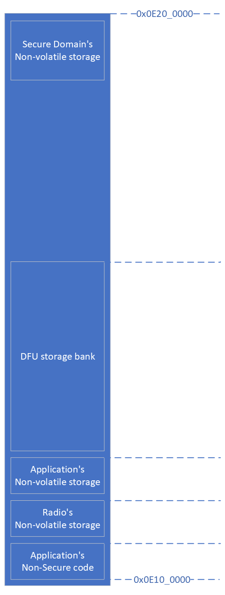

.. _ug_nrf54_architecture:

Software Architecture for nRF5420
#################################

nRF5420 is a multi-core System on Chip (SoC) using an asymmetric multiprocessing (AMP) configuration.
Each core is tasked with specific responsibilities and they cooperate to run the whole system use cases efficiently.

The software architecture documentation briefly describes the responsibilities of the cores and their inter-processor interactions.

Cores
*****

TODO: domains diagram (public and internal versions)

Application Core
================

The Application Core is the core with the highest processing power in the system.
Its purpose is to run the main application.

It is located in the Application Domain.

Fast Lightweight Processor
==========================

The Fast Lightweight Processor (FLPR) is a lightweight processor designed to offload from the application core simple tasks requiring low latencies or high processing power, like the hardware peripheral emulation.

This core is located in the Global Domain.

Peripheral Processor
====================

The Peripheral Processor (PPR) is a lightweight processor designed to perform simple ultra-low-power operations.
It manages data exchange with external devices using serial data transmission (SPI, UART, TWI) while the Application Core and the FLPR are in power-saving states.

This core is located in the Global Domain.

Radio Core
==========

The Radio Core is intended to run the radio protocol stacks (like |BLE|, IEEE 802.15.4, ESB, Gazell, or other proprietary ones) using the RADIO peripheral with multiprotocol support.
It is possible to use the remaining processing power of this core also for tasks other than the ones required by the radio protocol stacks.

The Radio Core is located in the Radio Domain.

Baseband Processor
==================

The Baseband Processor (BBPROC) is designed to run Radio Frequency (RF) algorithms in software, to support RF features not implemented in RADIO peripheral.

It is located in the Radio Domain.

Secure Domain
=============

The Secure Domain (SECDOM) provides security guarantees for the system with features like the following:

* Root of Trust
* System access protection configuration
* Secure storage
* Cryptographic operations
* Device firmware upgrade
* Crash handling
* Tamper detection

This core is located in the Secure Domain.

System Controller
=================

The System Controller (SYSCTRL) is a run-time manager of the SoC configuration.
Its main responsibility is power and clock management to meet the clock, frequency, latency, and power requirements of the programs running in other cores.

This core is located in the Global Domain.

Memory Layout
*************

The nRF5420 contains the following:

* Static RAM (SRAM, RAM)
* Magnetic RAM (MRAM) with non volatile memory properties

RAM
===

There are multiple RAM banks in the system.
Each local domain (like Application or Radio) contains its own RAM.
There is also a large part of the RAM in the global domain to be shared between the cores in the system.

TODO: diagram

Local RAM
---------

Local RAM is present in each of local domains

Application domain
^^^^^^^^^^^^^^^^^^

.. image:: images/nrf5420_memory_map_app.png
   :width: 300 px
   :align: left

The Application Domain contains 32 KB of local RAM.
Accessing this memory from the Application Core has minimal latency, but accessing it from any other core adds significant latency.
Because of this property, the local RAM in the application domain should be used mainly to store data frequently accessed by the Application Core, or to store timing-critical parts of the code executed by Application Core.

Address range
   0x22000000 - 0x22008000

Size
   32 KB

Access control
   Application domain local RAM is accessible by the Application Core.
   Any core (like FLPR or PPR) or peripheral configured to be owned by Application Core (like UARTE or SAADC) can access this memory as well.
   Any core with access to this memory can execute code from it.

   If the TrustZone feature is enabled for Application Core, this memory can be partitioned in one secure and one non-secure region.
   The secure region is accessible only by code executed with the secure attribute, while the non-secure region is accessible by any code.

   .. note::
      Code executed by VPRs (like FLPR or PPR) has its secure attribute matching the given VPR security configuration in the SPU.
      Local RAM cannot include a Non-Secure Callable section.

Radio domain
^^^^^^^^^^^^

.. image:: images/nrf5420_memory_map_radio.png
   :width: 300 px
   :align: left

The Radio domain contains 96 KB of local RAM.
Any access to this memory has minimal latency if originated either from Radio Core or from peripherals with EasyDMA located in radio domain.
Any access from any other core has a significant latency.
Because of this property, local RAM in the radio domain should be used mainly to store data frequently accessed by the Radio Core or the radio protocol frames to be accessed by CCM or RADIO peripherals, or to store timing critical parts of the code executed by the Radio Core.

Address range
   0x23000000 - 0x23018000

Size
   96 KB

Access control
   The Radio domain local RAM is accessible by the Radio Core.
   Any core (like FLPR or PPR) or peripheral configured to be owned by the Radio Core (like UARTE or SAADC) can access this memory as well.
   Any core with access to this memory can execute code from it.

   If the TrustZone feature is enabled for the Radio Core, this memory can be partitioned in one secure and one non-secure region.
   The secure region is accessible only by code executed with the secure attribute, while the non-secure region is accessible by any code.

   .. note::
      Code executed by VPRs (like FLPR or PPR) has its secure attribute matching the given VPR security configuration in the SPU
      Local RAM cannot include a Non-Secure Callable section.

BBPROC memory
"""""""""""""

TODO: diagram

The Lower 32 KB of local RAM in the Radio Domain (0x23010000 - 0x23018000) is tightly coupled with BBPROC.
Any access to this memory has minimal latency if originated from BBPROC.
Any access originated from the Radio Core or from peripherals with EasyDMA located in radio domain have a little greater latency while accessing BBPROC memory.
Access from other domains is possible, but with significant latency.

BBPROC memory is the only memory from which BBPROC can fetch its instructions.
Because of this property, this memory block is mostly intended to store BBPROC code and data.
When BBPROC is unused in a system, this memory can be used as additional local RAM in the Radio Domain.

Address range
   0x23010000 - 0x23018000

Size
   32 KB

Access control
   The access to the BBPROC memory is configured as the access to the local RAM in the Radio Domain.

Secure domain
^^^^^^^^^^^^^

.. image:: images/nrf5420_memory_map_secure.png
   :width: 300 px
   :align: left

The Secure Domain contains 64 KB of local RAM.
Any access to this memory from the Secure Domain core has minimal latency, but accesses from any other core have significant latency.
Because of this property, the local RAM in the Secure Domain should be used mainly to store data frequently accessed by its local core, or to store timing critical parts of the code executed by it.

Address range
   0x21000000 - 0x22010000

Size
   64 KB

Access control
   The Secure-Domain local RAM is accessible by its local core.
   Any core (like FLPR or PPR) or peripheral configured to be owned by the Secure Domain (like UARTE or SAADC) can access this memory as well.
   Any core with access to this memory can execute code from it.

   If the TrustZone feature is enabled for the Secure Domain, this memory can be partitioned in one secure and one non-secure region (both regions owned by Secure Domain).
   The secure region is accessible only by code executed with the Secure attribute, while the Non-secure region is accessible by any code.
   The Local RAM cannot include a Non-Secure Callable section.

Global RAM
----------

The Global Domain RAM (or Global RAM, GRAM) is distributed in multiple instances across the system.
Each of the instances has other properties and other purposes.

TODO: access control

General-purpose shared RAM (RAM0x)
^^^^^^^^^^^^^^^^^^^^^^^^^^^^^^^^^^

.. image:: images/nrf5420_memory_map_ram0x.png
   :width: 300 px

The biggest part of the RAM memory in the system is located in the Global Domain as general-purpose shared RAM.
Access to this memory is relatively fast from all the local domains (like the Application or the Radio ones).
Access to this memory from DMA used by USB has minimal latency.

This memory is intended to store the majority of the data used by local cores (and does not fit in local domains' RAM) including shared memory used for Inter-Processor Communication (IPC) between local cores.
Buffers for USB data must be stored in this memory part, in the region owned by the core owning USB (usually the Application Core in typical applications).

Address range
   0x2F000000 - 0x2F0E0000

Size
   896 KB

Access control
   The general-purpose shared RAM is split into multiple partitions.
   Each of the local cores has two partitions assigned: one configured as Secure, the other one as Non-Secure.
   The partitions are configured in the given core's UICR.

   If TrustZone is enabled for a core, the Secure partition is used to store the data of the Secure Processing Environment, while the Non-Secure partition stores the data of the Non-Secure Processing Environment and the shared memory used by the Inter-Processor Communication towards other local domains.
   If TrustZone is disabled for a core, the Secure partition assigned to this core is used to store program data, while the Non-Secure partition contains the shared memory used by IPC.

   Secure partitions are grouped at the beginning of the general-purpose shared RAM block, while Non-Secure partitions are grouped at the end.
   Non-Secure partitions are overlapping to define shared-memory IPC regions.

   A partition assigned to a core is accessible from this core, other cores owned by this core, or DMAs used by peripherals used by this core.
   Access from other cores or peripherals is prevented.
   A partition configured as Secure is accessible only from the Secure Processing Environment in the core owning the given partition.
   A partition configured as Non-Secure is accessible from both the Secure and Non-Secure Processing Environments running in the core owning the given partition.

   .. note::
      If TrustZone is disabled for a given core, the only available Processing Environment is Secure.

TODO: secure domain usage of RAM0x, full partitioning, table with MPC OVERRIDEs

SYSCTRL memory (RAM20)
^^^^^^^^^^^^^^^^^^^^^^

.. image:: images/nrf5420_memory_map_ram20.png
   :width: 300 px

Fast global RAM (RAM21)
^^^^^^^^^^^^^^^^^^^^^^^

.. image:: images/nrf5420_memory_map_ram21.png
   :width: 300 px

Slow global RAM (RAM3x)
^^^^^^^^^^^^^^^^^^^^^^^

.. image:: images/nrf5420_memory_map_ram3x.png
   :width: 300 px

MRAM (non volatile memory)
==========================

MRAM_10
^^^^^^^

.. image:: images/nrf5420_memory_map_mram10.png
   :width: 300 px

MRAM_11
^^^^^^^

MPC configuration
=================

The Secure Domain configures MPCs before it boots other domains.
MPC configuration provides rights for other cores to access memory regions assigned to them.
If a core tries to access a memory address not assigned to it, the transaction fails.

The Secure Domain can access all the memory regions in the system and does not require explicit access rights in MPC.

The Secure Domain configures OVERRIDEs in MPC assigned to ``AXI_0`` to provide the needed access rights:

===========  =====  ===========  ======================================================
OVERRIDE Id  Owner  Permissions  Regions
===========  =====  ===========  ======================================================
1            App    RW           App's NV storage; DFU storage bank
2            Radio  RW           Radio's NV storage
3            All    R            UICRs
4            App    RWS          SecDom <-> App IPC; App's Secure data
5            App    RW           Radio <-> App IPC; App's Non-Secure data
6            App    RXS          App's S-NSC; App's Secure code
7            App    RX           App's Non-Secure code
8            Radio  RWS          SecDom <-> Radio IPC; Radio's Secure data
9            Radio  RW           Radio <-> App IPC; Radio's Non-Secure data
10           Radio  RXS          Radio's S-NSC; Radio's Secure code
11           Radio  RX           Radio's Non-Secure code
===========  =====  ===========  ======================================================

Inter-Processor Communication
*****************************

Protocol layers
===============

Physical layer
^^^^^^^^^^^^^^

MAC, Network, Transport
^^^^^^^^^^^^^^^^^^^^^^^

Application layer
^^^^^^^^^^^^^^^^^

IPC connections scheme
======================

Radio core
----------

Secure Domain
-------------

System Controller
-----------------

FLPR
----

PPR
---

Reset Handling
**************

Reset sources
=============

Global
------

Local
-----

Reset Handling Procedure
========================

Global
------

Local
-----

Post-mortem debugging capabilities
==================================
