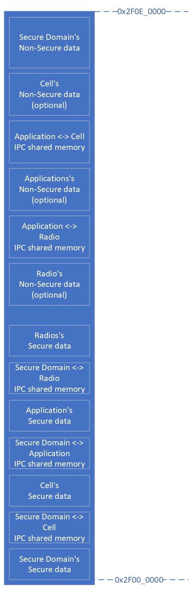
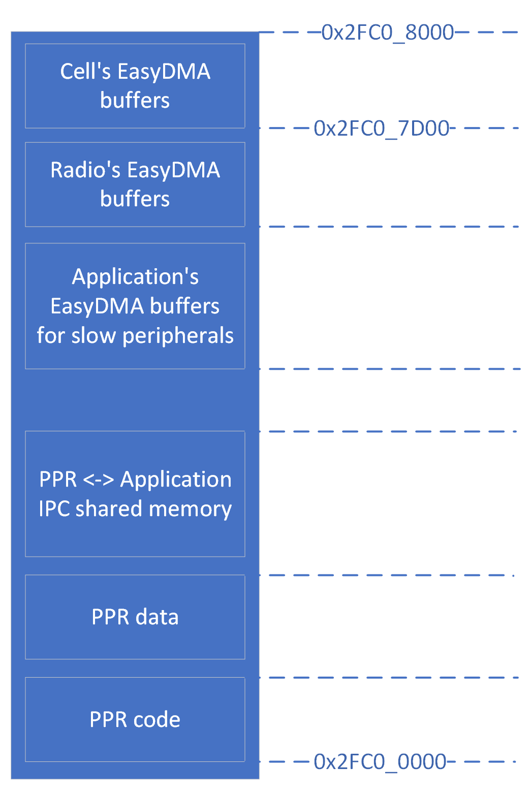
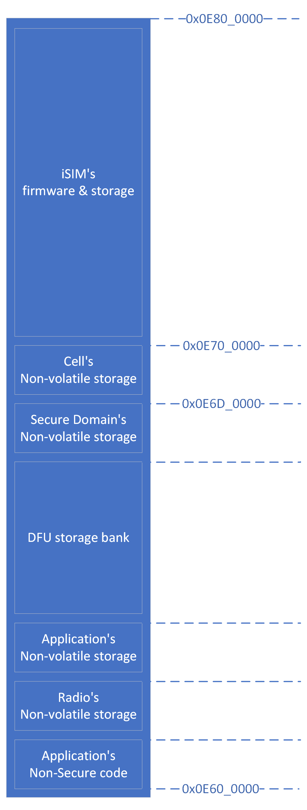

.. _ug_nrf92_architecture:

Software Architecture for nRF9230
#################################

The nRF9230 is a multicore System-in-Package (SiP) that uses an asymmetric multiprocessing (AMP) configuration.
Each core is tasked with specific responsibilities while they cooperate with each other to run the whole system use-cases efficiently.

The software architecture documentation briefly describes the responsibilities of the cores and their interprocessor interactions.

Cores
*****

.. TODO: domains diagram (public and internal versions)

The following are the cores available in the nRF9230, divided per domain:

* Application Domain:

   Application Core
      The Application Core is the core with the highest processing power in the system.
      Its purpose is to run the main application.
      It is also designed to have the highest active power efficiency, to run computing-intensive operations at optimal power consumption.

* Cellular Domains:

   Cellular Domains contain CPUs and peripherals providing Cellular and other long-range networks connectivity to the system, including LTE-M, NB-IoT, GNSS.

* Global Domain:

   System Controller
      The System Controller (SYSCTRL) is the run-time manager of the SoC configuration.
      Its main responsibility is power and clock management to meet the clock, frequency, latency, and power requirements of the programs running in other cores.

   Fast Lightweight Processor
      The Fast Lightweight Processor (FLPR) is a lightweight processor designed to offload from the application core simple tasks requiring low latencies or high processing power, like the hardware peripheral emulation.

   Peripheral Processor
      The Peripheral Processor (PPR) is a lightweight processor designed to offload simple ultra-low-power operations, like low-level peripheral handling, from the main processors.
      It manages data exchange with external devices using serial data transmission (SPI, UART, TWI) while the Application Core and the FLPR are in power-saving states.
      It is optimized for very low interrupt latencies and can start and stop very quickly.

* Radio Domain:

   Radio Core
      The Radio Core is intended to run the radio protocol stacks (like BLE, IEEE 802.15.4, ESB, Gazell, or other proprietary ones) using the RADIO peripheral with multiprotocol support.
      It is optimized to quickly start and stop tasks typical for protocol stacks workloads.
      It is also possible to use the remaining processing power of this core for tasks other than the ones required by the radio protocol stacks.

   Baseband Processor
      The Baseband Processor (BBPROC) is designed to run Radio Frequency (RF) algorithms in software, in order to support RF features not implemented in the RADIO peripheral.

* Secure Domain:

   Secure Domain Core
      The Secure Domain (SECDOM) provides security guarantees for the system with the following features:

      * Root of Trust
      * System access protection configuration
      * Secure storage
      * Cryptographic operations
      * Device firmware upgrade
      * Crash handling
      * Tamper detection

Memory Layout
*************

The nRF9230 contains the following:

* Static RAM (SRAM, RAM)
* Magnetic RAM (MRAM) with non volatile memory properties

RAM
===

There are multiple RAM banks in the system.
Each local domain (like Application or Radio) contains its own RAM.
There is also a large part of the RAM in the global domain to be shared between the cores in the system.

TODO: diagram

Local RAM
---------

The local RAM is present in each of local domains

Application domain
^^^^^^^^^^^^^^^^^^

.. image:: images/nrf9230_memory_map_app.png
   :width: 300 px
   :align: left

The Application Domain contains 32 KB of local RAM.
Accessing this memory from the Application Core has minimal latency, but accessing it from any other core adds significant latency.
Because of this property, the local RAM in the application domain should be used mainly to store data frequently accessed by the Application Core, or to store timing-critical parts of the code executed by Application Core.

Address range
   0x22000000 - 0x22008000

Size
   32 KB

Access control
   The local RAM of the Application domain is accessible by the Application Core.
   Any core (like FLPR or PPR) or peripheral configured to be owned by the Application Core (like UARTE or SAADC) can access this memory as well.
   Any core with access to this memory can execute code from it.

   If the TrustZone feature is enabled for Application Core, this memory can be partitioned in one secure and one non-secure region.
   The secure region is accessible only by code executed with the secure attribute, while the non-secure region is accessible by any code.

   .. note::
      Code executed by VPRs (like FLPR or PPR) has its secure attribute matching the given VPR security configuration in the SPU.
      Local RAM cannot include a Non-Secure Callable section.

Radio domain
^^^^^^^^^^^^

.. image:: images/nrf9230_memory_map_radio.png
   :width: 300 px
   :align: left

The Radio domain contains 224 KB of local RAM.
Any access to this memory has minimal latency if originated either from the Radio Core or from peripherals with EasyDMA located in the Radio domain.
Any access from any other core has a significant latency.
Because of this property, the local RAM in the radio domain should be used mainly to store data frequently accessed by the Radio Core or the radio protocol frames to be accessed by the CCM or RADIO peripherals, or to store timing-critical parts of the code executed by the Radio Core.

Address range
   0x23000000 - 0x23030000
   0x23040000 - 0x23048000

Size
   224 KB

Access control
   The Radio domain local RAM is accessible by the Radio Core.
   Any core (like FLPR or PPR) or peripheral configured to be owned by the Radio Core (like UARTE or SAADC) can access this memory as well.
   Any core with access to this memory can execute code from it.

   If the TrustZone feature is enabled for the Radio Core, this memory can be partitioned in one secure and one non-secure region.
   The secure region is accessible only by code executed with the secure attribute, while the non-secure region is accessible by any code.

   .. note::
      Code executed by VPRs (like FLPR or PPR) has its secure attribute matching the given VPR security configuration in the SPU.
      Local RAM cannot include a Non-Secure Callable section.

BBPROC memory
"""""""""""""

TODO: diagram

The Lower 32 KB of the local RAM in the Radio Domain (0x23040000 - 0x23048000) are tightly coupled with BBPROC.
Any access to this memory has minimal latency if originated from BBPROC.
Any access originated from the Radio Core, or from peripherals with EasyDMA located in the radio domain, have a little greater latency while accessing the BBPROC memory.
Access from other domains is possible but with significant latency.

BBPROC memory is the only memory from which BBPROC can fetch its instructions.
Because of this property, this memory block is mostly intended to store BBPROC code and data.
When BBPROC is unused in a system, this memory can be used as additional local RAM in the Radio Domain.

Address range
   0x23040000 - 0x23048000

Size
   32 KB

Access control
   The access to the BBPROC memory is configured as the access to the local RAM in the Radio Domain.

Secure domain
^^^^^^^^^^^^^

.. image:: images/nrf9230_memory_map_secure.png
   :width: 300 px
   :align: left

The Secure Domain contains 32 KB of local RAM.
Any access to this memory from the Secure Domain core has minimal latency, but accesses from any other core have significant latency.
Because of this property, the local RAM in the Secure Domain should be used mainly to store data frequently accessed by its local core, or to store timing-critical parts of the code executed by it.

Address range
   0x21000000 - 0x21008000

Size
   32 KB

Access control
   The Secure-Domain local RAM is accessible by its local core.
   Any core (like FLPR or PPR) or peripheral configured to be owned by the Secure Domain (like UARTE or SAADC) can access this memory as well.
   Any core with access to this memory can execute code from it.

   If the TrustZone feature is enabled for the Secure Domain, this memory can be partitioned in one secure and one non-secure region (with both regions owned by the Secure Domain).
   The secure region is accessible only by code executed with the Secure attribute, while the Non-secure region is accessible by any code.
   The Local RAM cannot include a Non-Secure Callable section.

Global RAM
----------

The Global Domain RAM (or Global RAM, GRAM) is distributed in multiple instances across the system.
Each one of the instances has specific properties and purposes.

Generally, the Global RAM can be allocated to various cores or used as a shared memory, but access can involve wait states or latency.
This can be partially mitigated by L1 caching.

TODO: access control

General-purpose shared RAM (RAM0x)
^^^^^^^^^^^^^^^^^^^^^^^^^^^^^^^^^^

The biggest part of the RAM memory in the system is located in the Global Domain as general-purpose shared RAM.
Access to this memory is relatively fast from all the local domains (like the Application or the Radio ones).
Access to this memory from the DMA used by USB has minimal latency.

This memory is intended to store the majority of the data used by local cores (and that does not fit in the local domains' RAM) including shared memory used for Inter-Processor Communication (IPC) between local cores.
Buffers for USB data must be stored in this memory part, in the region owned by the core owning USB (usually the Application Core in typical applications).

Address range
   0x2F000000 - 0x2F0E0000

Size
   896 KB

Access control
   The general-purpose shared RAM is split into multiple partitions.
   Each of the local cores has two partitions assigned: one configured as Secure, the other one as Non-Secure.
   The partitions are configured in the given core's UICR.

   If TrustZone is enabled for a core, the Secure partition is used to store the data of the Secure Processing Environment, while the Non-Secure partition stores the data of the Non-Secure Processing Environment and the shared memory used by the Inter-Processor Communication towards other local domains.
   If TrustZone is disabled for a core, the Secure partition assigned to this core is used to store program data, while the Non-Secure partition contains the shared memory used by IPC.

   Secure partitions are grouped at the beginning of the general-purpose shared RAM block, while Non-Secure partitions are grouped at the end.
   Non-Secure partitions are overlapping to define shared-memory IPC regions.

   A partition assigned to a core is accessible from this core, other cores owned by this core, or DMAs used by peripherals used by this core.
   Access from other cores or peripherals is prevented (with the exception of the Secure Domain Core which has access to all partitions).
   A partition configured as Secure is accessible only from the Secure Processing Environment in the core owning the given partition.
   A partition configured as Non-Secure is accessible from both the Secure and Non-Secure Processing Environments running in the core owning the given partition.

   .. note::
      If TrustZone is disabled for a given core, the only available Processing Environment is Secure.

TODO: secure domain usage of RAM0x, full partitioning, table with MPC OVERRIDEs

SYSCTRL memory (RAM20)
^^^^^^^^^^^^^^^^^^^^^^

.. image:: images/nrf9230_memory_map_ram20.png
   :width: 300 px
   :align: left

The SYSCTRL memory is a part of the global RAM tightly coupled with the System Controller.
Access to this memory block from the System Controller has minimal latency and can be performed without powering up any other parts of the system.
Access to this memory from the local domains has higher latency than access to the general-purpose shared RAM.

This memory is statically partitioned.
The layout is not to be adjusted for specific products.

This memory is intended to store the code executed in the System Controller, the System Controller's data, and the shared memory used for Inter-Processor Communication between the System Controller and other cores.
Because of the static allocation property, this memory stores also the shared memory used for communication between debugger probes connected to cores in the system and the Secure Domain Core.

Address range
   0x2F880000 - 0x2F890000

Size
   64 KB

Access control
   The SYSCTRL memory is split into multiple partitions.
   The System Controller has access to all of them (System Controller's code and data, and shared memory regions).
   The shared memory regions are also accessible by the cores using a particular region for communication with the System Controller and the debugger.
   The shared memory regions are configured in the given core's UICR.
   Cores do not have access to other parts of the SYSCTRL memory.

   If TrustZone is enabled for a core, the shared memory region is accessible from the Non-Secure Processing Environment.
   If TrustZone is disabled for a core, the shared memory region is accessible from the Secure Processing Environment.

Fast global RAM (RAM21)
^^^^^^^^^^^^^^^^^^^^^^^

.. image:: images/nrf9230_memory_map_ram21.png
   :width: 300 px
   :align: left

The Fast global RAM is a part of the global RAM tightly coupled with the Fast Lightweight Processor.
Access to this memory block from the FLPR and fast peripherals' DMA (I3C, CAN, PWM120, UARTE120, SPIS120, SPIM120, SPIM121) has minimal latency and can be performed without powering up any other parts of the system.
Access to this memory from the local domains has higher latency than access to the general-purpose shared RAM.

This memory is intended to store the code executed in the FLPR, the FLPR's data, the shared memory used for Inter-Processor Communication between the FLPR and the core managing the FLPR, and DMA buffers for the fast peripherals.

Address range
   0x2F890000 - 0x2F898000

Size
   32 KB

Access control
   The FLPR and its owner have access to all partitions assigned to FLPR and its Inter-Processor Communication.
   Each of the memory partition assigned for DMA of the fast peripherals is accessible from the core owning a given set of peripherals.
   The FLPR and the fast peripherals are by default owned by the Application Core.
   This ownership and matching memory access rights can be customized in UICRs.

   The security attribute of memory partitions must follow FLPR and DMA engines security settings.

Slow global RAM (RAM3x)
^^^^^^^^^^^^^^^^^^^^^^^

MRAM (non volatile memory)
==========================

MRAM_10
-------

.. image:: images/nrf9230_memory_map_mram10.png
   :width: 300 px

MRAM_11
-------

Memory Priviledge Controllers configuration
===========================================

The Secure Domain configures MPCs before it boots other domains.
MPC configuration provides rights for other cores to access memory regions assigned to them.
If a core tries to access a memory address not assigned to it, the transaction fails.

The Secure Domain can access all the memory regions in the system and does not require explicit access rights in MPC.

The Secure Domain configures OVERRIDEs in MPC assigned to ``AXI_0`` to provide the needed access rights:

===========  =====  ===========  ==========  ======================================================
OVERRIDE Id  Owner  Permissions  SECUREMASK  Regions
===========  =====  ===========  ==========  ======================================================
3            All    R            any         UICRs
4            App    RW           1           Radio <-> App IPC; App's Non-Secure data
5            App    RWS          1 *         SecDom <-> App IPC; App's Secure data
6            App    RX           1           App's Non-Secure code
7            App    RXS          0           App's S-NSC; App's Secure code
8            Radio  RW           1           Radio <-> App IPC; Radio's Non-Secure data
9            Radio  RWS          1 *         SecDom <-> Radio IPC; Radio's Secure data
10           Radio  RX           1           Radio's Non-Secure code
11           Radio  RXS          0           Radio's S-NSC; Radio's Secure code
12           Cell   RW           1           Cell <-> App IPC; Cell's Non-Secure data
13           Cell   RWS          1 *         SecDom <-> Cell IPC; Cell's Secure data
14           Cell   RX           1           Cell's Non-Secure code
15           Cell   RXS          0           Cell's S-NSC; Cell's Secure code
21           ISIM   RWX          0           ISIM's code and storage
29           App    RW           1           App's NV storage; DFU storage bank
30           Radio  RW           1           Radio's NV storage
31           Cell   RW           1           Cell's NV storage
===========  =====  ===========  ==========  ======================================================

.. note::
   SECUREMASK can be set to ``0`` for any secure memory partition.
   However, beause of the hardware configuration, OVERRIDEs marked with * have SECUREMASK set to ``1``.
   Such configuration implies that addresses of this entry should have 28th bit cleared.
   It does not expose any security thread because permissions filtering denies access from non-secure masters.

The Secure Domain configures OVERRIDEs in the MPC assigned to ``AXI_1`` to provide the access rights needed:

===========  =======  ===========  ==========  ================================================================================================================
OVERRIDE Id  Owner    Permissions  SECUREMASK  Regions
===========  =======  ===========  ==========  ================================================================================================================
5            SysCtrl  RW           1           Radio's non-volatile storage; App's non-volatile storage; DFU storage bank; Secure Domain's non-volatile storage
===========  =======  ===========  ==========  ================================================================================================================

   .. note::
      During the installation step of the Device Firmware Update procedure, write access is enabled for more MRAM partitions.
      During this step the only active core is the Secure Domain Core.

The Secure Domain configures OVERRIDEs in the MPC assigned to ``AXI_2`` to provide the access rights needed:

===========  =====  ===========  ==========  ==============================================================================
OVERRIDE Id  Owner  Permissions  SECUREMASK  Regions
===========  =====  ===========  ==========  ==============================================================================
1            App    RW           1           Application mngMbox; SysCtrl <-> App IPC
2            App    RWX          1           FLPR code; FLPR data; FLPR <-> App IPC; DMA buffers for App's fast peripherals
3            Radio  RW           1           Radio mngMbox; SysCtrl <-> Radio IPC
4            Radio  RW           1           DMA buffers for Radio's fast peripherals (if any)
5            Cell   RW           1           Cell mngMbox; SysCtrl <-> Cell IPC
6            Cell   RW           1           DMA buffers for Cell's fast peripherals (if any)
===========  =====  ===========  ==========  ==============================================================================

The Secure Domain configures OVERRIDEs in the MPC assigned to ``AXI_3`` to provide the access rights needed:

===========  =====  ===========  ==========  ===========================================================================
OVERRIDE Id  Owner  Permissions  SECUREMASK  Regions
===========  =====  ===========  ==========  ===========================================================================
1            App    RWX          1           PPR code; PPR data; PPR <-> App IPC; DMA buffers for App's slow peripherals
3            Radio  RW           1           DMA buffers for Radio's slow peripherals (if any)
6            Cell   RW           1           DMA buffers for Cell's slow peripherals (if any)
===========  =====  ===========  ==========  ===========================================================================

.. TODO: Diagrams showing memory view from App's SPE, App's NSPE, maybe for other cores as well?

Security Attribution Unit configuration
=======================================

Each Cortex-M33 CPU in the system with the TrustZone feature enabled (Application, Radio, Secure Domain Core) associates a Security Attribution Unit (SAU) peripheral.
Each Cortex-M33 CPU configures SAUs for itself during its initialization before it switches to the Non-Secure Processing Environment (NSPE).
SAU configuration provides rights for the Non-Secure Processing Environment to access resources allocated to it.
If NSPE tries to access a memory address not allocated to it, the transaction fails.

=============  ==================  ===================================  ============================================================================================================================================================
SAU region Id  Security attribute  Region                               Comments
=============  ==================  ===================================  ============================================================================================================================================================
0              NS                  0x0000_0000 - 0x1000_0000            Whole non-secure address space of MRAM. Proper partitioning is done in MPC
1              NS                  Core's S-NSC in MRAM                 S-NSC veneers in secure address space of MRAM
2              NS                  0x2000_0000 - 0x3000_0000            Whole non-secure address space of RAM. Proper partitioning is done in MPC
3              NS                  Core's S-NSC in RAM - 0x1_0000_0000  S-NSC veneers in secure address space of global MRAM, all peripherals, external memory, CPU registers. If no S-NSC in RAM start address shall be 0x4000_0000
=============  ==================  ===================================  ============================================================================================================================================================

Interprocessor Communication
****************************

Protocol layers
===============

Physical layer
--------------

MAC, Network, Transport
-----------------------

Application layer
-----------------

IPC connections scheme
======================

Radio core
----------

Secure Domain
-------------

System Controller
-----------------

FLPR
----

PPR
---

Reset Handling
**************

Reset sources
=============

Global
------

Local
-----

Reset Handling Procedure
========================

Global
------

Local
-----

Post-mortem debugging capabilities
==================================
