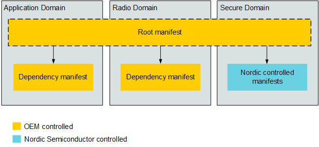
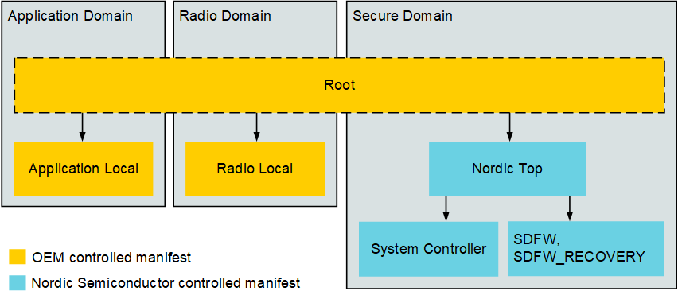

.. _ug_nrf54h20_suit_hierarchical_manifests:

Hierarchical manifests
######################

.. contents::
   :local:
   :depth: 2

The Software Updates for the Internet of Things (SUIT) procedure provides the option to employ a hierarchical manifest system.
This hierarchical manifest system is a specific type of manifest topology, and functions as a delivery chain, allowing for versatile customization of the Device Firmware Update (DFU) process across various specific use cases.
The nRF54H20 System on Chip (SoC) contains multiple cores which may require multiple manifests, hence the need for a hierarchal manifest topology.

The hierarchical manifest system, which entails multiple manifests, allows for properties to be assigned to specific manifests. Some example use cases where hierarchical manifests are beneficial are:

* When different components (that are declared within the manifest) need to have different access rights to certain memory locations on the device.

* When your final application only needs one manifest that requires downgrade prevention instructions, while several other Domains (hence, manifests) do not need these instructions.

To perform a DFU procedure on the nRF54H20 SoC, you must use either the manifest templates provided by Nordic Semiconductor or the manifest generator to create your own.
Additionally, there may be some use cases where you will have to modify the manifests or the topology for your specific use case.
See the :ref:`ug_nrf54h20_suit_create_manifest` page for instructions on how to modify values in the manifest.

Default manifest topology
*************************

The design of the hierarchy of the manifests is considered the manifest topology.
The hierarchical manifest topology can be described as having a root manifest, with several dependency manifests within it.
A dependency manifest contains a specific updatable image or payload for a specific Domain of the device.
Therefore, there can be multiple dependency manifests required.
The root manifest bundles all the dependency manifests into a single executable image for the DFU.

   General overview of hierarchical manifest topology for the nRF54H20 SoC

Using SUIT’s hierarchical manifest involves using your own generated manifests (OEM-controlled) in combination with manifests provided by Nordic Semiconductor, particularly for the Secure Domain (SecDom) and System Controller.
An example of how this would be implemented includes:

* OEM-controlled manifests

   * A root manifest that coordinates update and invocation processes on its dependency manifests.
     It does not belong to any domain or control any local domain resources.

   * A dependency manifest for each of the domains, such as the Application and Radio Domains.

* Nordic Semiconductor controlled manifests

   * Nordic "Top" manifest

   * System Controller manifest

   * SDFW manifest

   Detailed view of hierarchical manifest topology for the nRF54H20 SoC

Read the :ref:`ug_nrf54h20_suit_create_manifest` user guide for instructions.

Important considerations
************************

Some important considerations to keep in mind with SUIT’s hierarchical manifests are described below.

Managing dependencies
=====================

Effectively managing dependencies between various manifests and components is essential for a successful DFU process.
This is handled within the manifest by the ``SUIT_Dependencies`` manifest element, which is found within ``SUIT_Common``.
``SUIT_Dependencies`` identifies which components from ``suit-components`` are to be treated as dependency manifest envelopes.
It also allows for the separation of responsibilities and signing authorities.

To ensure that all manifests will run as expected, you must assign the correct version information to each dependency manifest.
This version information should be part of the manifest's Universal Unique Identifiers (UUID).

.. _ug_suit_hier_targeting_domains:

Targeting specific domains with UUIDs
=====================================

To be able to target a specific product in the DFU, you must declare the correct device with ``class-identifier`` and ``vendor-identifier`` which must be given as UUIDs.
The SUIT procedure mandates that UUIDs (16 bytes) are to be used.
The UUIDs declared are associated with the manifest it belongs to.
Therefore, specifying the correct UUID allows for a targeted DFU approach, where specific release packages declared in a manifest are instructed to go to a specific product.

.. note::
   UUIDs for the SecDom, which is controlled by Nordic Semiconductor, may not be altered as they are already provisioned into the device.
   For instructions on how to modify and generate UUIDs, see the :ref:`ug_nrf54h20_suit_create_manifest` page.
